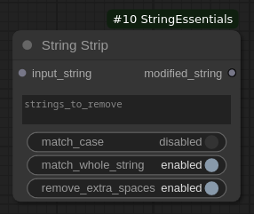
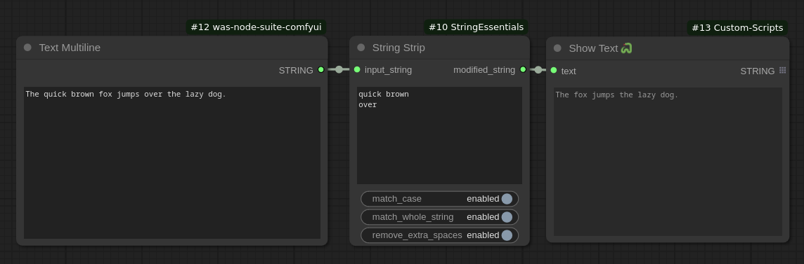
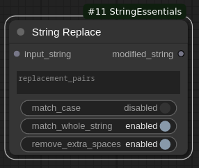
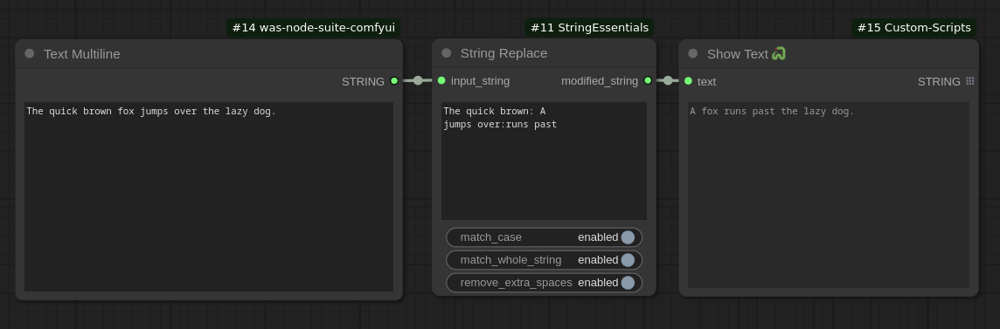

# String Essentials - Custom nodes for ComfyUI

Custom nodes for ComfyUI that provide text/string manipulation capabilities. Particularly useful for modifying text from LLM outputs (Ollama, Claude.ai, OpenAI ChatGPT), such as prompts or image-to-text description results.

## Features
- Remove or replace text, words, numbers in input strings
- Handle multi-word strings (partial sentences/phrases)
- Case-sensitive/insensitive matching
- Whole string matching option

## String Strip Node
Removes specified strings from input text. Each line should contain the string to be searched. The string can contain multiple words. To match individual words/strings place on separate lines.



### Inputs
- **`input_string`**: The string or text to process
- **`strings_to_remove`**: List of strings to remove (one per line)
- **`match_case`**: Enable/disable case-sensitive matching (default: disabled)
- **`match_whole_string`**: Ensure only exact matches are removed (default: enabled)
- **`remove_extra_spaces`**: Clean up extra spaces after removal (default: enabled)

### String Strip Example Usage:


## String Replace Node
Replaces text strings with new strings. Each line should contain a search and replace pair separated by the replacement_delimiter (default is double colon `::`).



### Inputs
- **`input_string`**: The string or text to process
- **`replacement_pairs`**: List of search::replace pairs (one per line)
- **`replacement_delimiter`**: Character(s) that separate search and replace strings (default: `::`)
- **`match_case`**: Enable/disable case-sensitive matching (default: disabled)
- **`match_whole_string`**: Ensure only exact matches are replaced (default: disabled)
- **`remove_extra_spaces`**: Clean up extra spaces after replacement (default: enabled)

### String Replace Example Usage:


## Installation
1. Navigate to the `custom_nodes` directory in your ComfyUI installation path.
2. Clone the repository:
```bash
git clone https://github.com/bradsec/ComfyUI_StringEssentials.git
```
3. Restart ComfyUI or refresh your nodes.
4. Select node from the utils menu. `Add Node > utils >` `String Strip` or `String Replace`