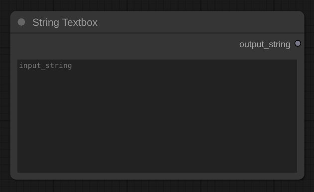
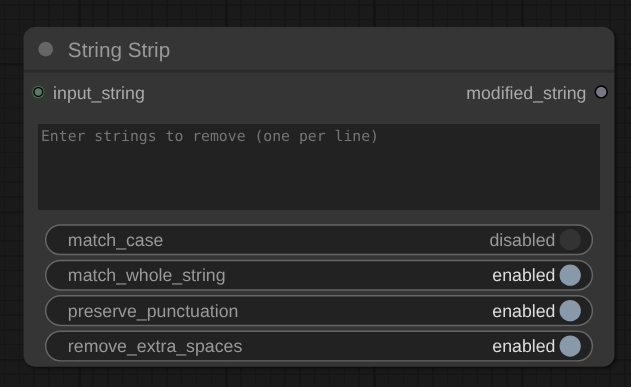
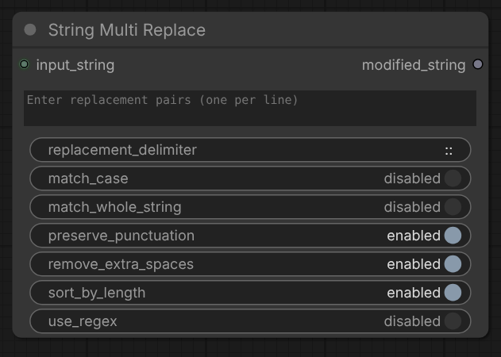
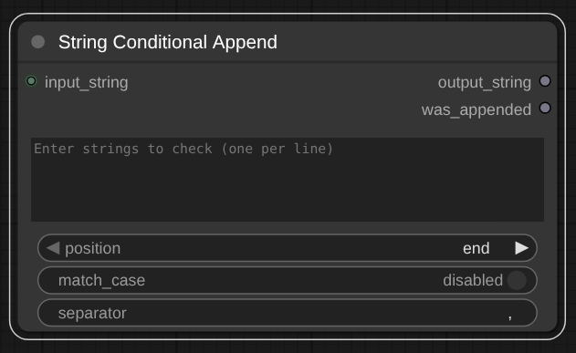
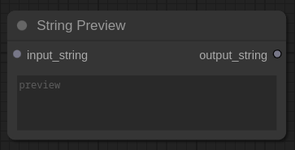
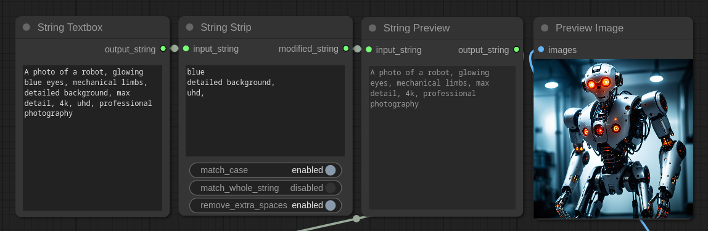
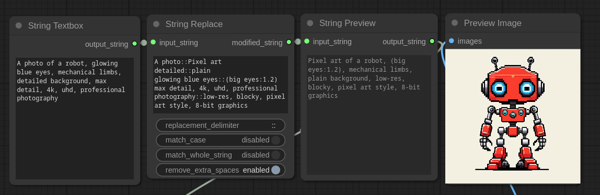

# String Essentials - Custom nodes for ComfyUI

Simple string manipulation nodes for ComfyUI (strip/remove text strings, search and replace text strings, preview modified string outputs). Useful for modifying text from LLM outputs (Ollama, Claude.ai, OpenAI ChatGPT), such as prompts or image-to-text description results. No additional Python dependencies or external modules required. Nodes use a small amount of basic Python and Javascript code.

## Nodes included:

- String Textbox
- String Strip
- String Multi Replace
- String Conditional Append
- String Contains Any
- String Preview

***Once added nodes can be found under the `Add Node` > `utils` > `StringEssentials` menu.***

## Features
- Remove or replace text, words, numbers in input strings
- Conditionally append text only when not already present
- Check if text contains any of multiple substrings (for conditional workflows)
- Handle multi-word strings (partial sentences/phrases)
- Case-sensitive/insensitive matching
- Whole string matching option
- Preserve punctuation in prompts and special syntax (parentheses, colons, brackets)

## String Textbox
A simple multiline textbox for free form text.  
  
  
  
## String Strip
Removes specified strings from input text. Each line should contain the string to be searched. The string can contain multiple words. To strip multiple individual words/strings place on separate lines.



### Inputs
- **`input_string`**: The string or text to process
- **`strings_to_remove`**: List of strings to remove (one per line)
- **`match_case`**: Enable/disable case-sensitive matching
- **`match_whole_string`**: Ensure only exact matches are removed
- **`preserve_punctuation`**: Keep punctuation marks adjacent to matched text (default: enabled)
- **`remove_extra_spaces`**: Clean up extra spaces after removal

## String Multi Replace
Replaces text strings with new strings (replace/swap words etc.). Each line should contain a search and replace pair separated by the replacement_delimiter (default is double colon `::`). Example to replace dog with cat `dog::cat`. Supports mulitple string replacements, just add one replacement per line. You can also remove strings with this node just leave the right side of the delimiter blank.



### Inputs
- **`input_string`**: The string or text to process
- **`replacement_pairs`**: List of search::replace pairs (one per line)
- **`replacement_delimiter`**: Character(s) that separate search and replace strings (default: `::`)
- **`match_case`**: Enable/disable case-sensitive matching
- **`match_whole_string`**: Ensure only exact matches are replaced
- **`preserve_punctuation`**: Keep punctuation marks adjacent to matched text (default: enabled)
- **`remove_extra_spaces`**: Clean up extra spaces after replacement

## String Conditional Append
Conditionally adds strings to the input text only if they're not already present. Useful for ensuring specific keywords or phrases exist in prompts without creating duplicates. Enter multiple strings (one per line) to check and append any that are missing.



### Inputs
- **`input_string`**: The string or text to process (connection input)
- **`strings_to_check`**: List of strings to search for and append if not found (one per line)
- **`position`**: Where to add strings if not found (`end` or `beginning`)
- **`match_case`**: Enable/disable case-sensitive search
- **`separator`**: Character(s) to use between text and appended strings (default: `, `)

### Outputs
- **`output_string`**: The resulting text (with or without appended strings)
- **`was_appended`**: Boolean indicating whether any strings were added

## String Contains Any
Checks if the input string contains any of the specified substrings. Returns a boolean result and the first matched substring. Useful for conditional workflows, such as loading specific LoRAs based on prompt keywords (e.g., load anime LoRA if prompt contains "anime", "manga", or "cel-shaded").

### Inputs
- **`input_string`**: The string or text to search within (connection input)
- **`substrings`**: List of substrings to search for (one per line)
- **`match_case`**: Enable/disable case-sensitive search (default: disabled)

### Outputs
- **`contains_any`**: Boolean indicating whether any substring was found
- **`matched_string`**: The first substring that was found (empty string if none matched)

## String Preview
Simply displays a string output. Can be used to view the results/changes to the input_string by the `String Strip` or `String Replace`.  
  

  
## Example Usage  
  
  
  


## Installation
1. Navigate to the `custom_nodes` directory in your ComfyUI installation path.
2. Clone the repository:
```bash
git clone https://github.com/bradsec/ComfyUI_StringEssentials.git
```
3. Restart ComfyUI or refresh your nodes.
4. Select nodes from the `Add Node` > `utils` > `StringEssentials` menu.


### [Found these nodes useful? ⭐ Star the repo github.com/bradsec/ComfyUI_StringEssentials.](https://github.com/bradsec/ComfyUI_StringEssentials "BRADSEC ComfyUI_StringEssentials")

