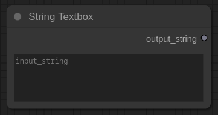
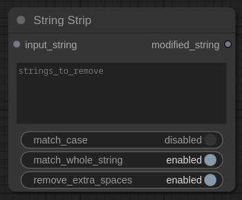
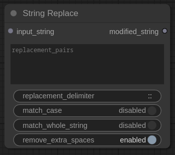

# String Essentials - Custom nodes for ComfyUI

Simple string manipulation nodes for ComfyUI (strip/remove text strings, search and replace text strings, preview modified string outputs). Particularly useful for modifying text from LLM outputs (Ollama, Claude.ai, OpenAI ChatGPT), such as prompts or image-to-text description results. No bloat/additional Python dependencies or external modules required. Nodes use a small amount of basic Python and Javascript code.

## Nodes included:

- String Textbox
- String Strip
- String Replace
- String Preview

***Once added nodes can be found under the `Add Node` > `utils` menu.***

## Features
- Remove or replace text, words, numbers in input strings
- Handle multi-word strings (partial sentences/phrases)
- Case-sensitive/insensitive matching
- Whole string matching option

## String Textbox
A simple multiline textbox for free form text.  
  
  
  
## String Strip
Removes specified strings from input text. Each line should contain the string to be searched. The string can contain multiple words. To strip multiple individual words/strings place on separate lines.



### Inputs
- **`input_string`**: The string or text to process
- **`strings_to_remove`**: List of strings to remove (one per line)
- **`match_case`**: Enable/disable case-sensitive matching (default: disabled)
- **`match_whole_string`**: Ensure only exact matches are removed (default: enabled)
- **`remove_extra_spaces`**: Clean up extra spaces after removal (default: enabled)

## String Replace
Replaces text strings with new strings (replace/swap words etc.). Each line should contain a search and replace pair separated by the replacement_delimiter (default is double colon `::`). Example to replace dog with cat `dog::cat`. Supports mulitple string replacements, just add one replacement per line.



### Inputs
- **`input_string`**: The string or text to process
- **`replacement_pairs`**: List of search::replace pairs (one per line)
- **`replacement_delimiter`**: Character(s) that separate search and replace strings (default: `::`)
- **`match_case`**: Enable/disable case-sensitive matching (default: disabled)
- **`match_whole_string`**: Ensure only exact matches are replaced (default: disabled)
- **`remove_extra_spaces`**: Clean up extra spaces after replacement (default: enabled)

## String Preview
Simply displays a string output. Can be used to view the results/changes to the input_string by the `String Strip` or `String Replace`.  
  

  
## Example Usage  
  


## Installation
1. Navigate to the `custom_nodes` directory in your ComfyUI installation path.
2. Clone the repository:
```bash
git clone https://github.com/bradsec/ComfyUI_StringEssentials.git
```
3. Restart ComfyUI or refresh your nodes.
4. Select node from the `Add Node` > `utils` menu.


### If you found these nodes useful please star the repo.